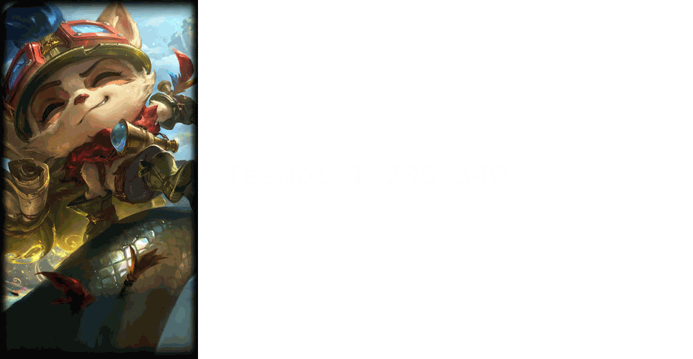

<p align="center">
  <a href="https://github.com/murriiii"></a>
</p>

<p align="center">
  <a href="https://www.linkedin.com/in/muratince89"></a>
  
</p>

<p align="center">
  <picture>
    <source media="(prefers-color-scheme: dark)" srcset="https://raw.githubusercontent.com/murriiii/murriiii/output/github-snake-dark.svg"/>
    <source media="(prefers-color-scheme: light)" srcset="https://raw.githubusercontent.com/murriiii/murriiii/output/github-snake.svg"/>
    
  </picture>
</p>

---

```js
const murat = {
    role: ["SAP Developer", "Mathematician"],
    education: "B.Sc. Mathematics",
    code: ["TypeScript", "Swift", "Python", "ABAP", "Dart", "SQL"],
    interests: {
        mobile: "iOS & Cross-Platform Development",
        web: "Full-Stack with Next.js & TypeScript",
        sap: "Clean ABAP, RAP & Fiori",
        ai: "Machine Learning & Applied AI",
    },
    currentProject: "Building iOS & web apps",
    motto: "Late-game scaling — in code and in life.",
};
```

---

#### `> tech stack`

<table align="center">
<tr><td align="center"><b>Languages</b></td>
<td>


</td></tr>
<tr><td align="center"><b>SAP</b></td>
<td>


</td></tr>
<tr><td align="center"><b>ML & Data</b></td>
<td>


</td></tr>
<tr><td align="center"><b>Infra</b></td>
<td>


</td></tr>
<tr><td align="center"><b>Frameworks</b></td>
<td>


</td></tr>
<tr><td align="center"><b>Web3</b></td>
<td>


</td></tr>
</table>

---

#### `> after hours`

<!---LOL-STATS-START-HERE--->
<h3 align='center'>i know i'm a noob, but even a noob has pride :D - ムラット#2349</h3><table align='center'><tr></tr>
<tr align='left'><th><pre>Lane Distribution (Last 100 Games)
-------------------------


-------------------------
</pre></th><th><pre>Top 3 Champion Masteries
------------------------
 </pre></th></tr></table>

<details>
<summary><h4 align='center'>Recent Matches</h4></summary>
<table align='center'>
<tr><th></th><th>Champion</th><th>K/D/A</th><th>KDA</th><th>CS</th><th>Result</th></tr>
<tr><td></td><td><b>Teemo</b></td><td align='center'>7/9/8</td><td align='center'>1.7</td><td align='center'>252</td><td align='center'></td></tr>
<tr><td></td><td><b>Mordekaiser</b></td><td align='center'>4/6/4</td><td align='center'>1.3</td><td align='center'>148</td><td align='center'></td></tr>
<tr><td></td><td><b>Urgot</b></td><td align='center'>10/6/1</td><td align='center'>1.8</td><td align='center'>207</td><td align='center'></td></tr>
<tr><td></td><td><b>Malphite</b></td><td align='center'>11/8/7</td><td align='center'>2.2</td><td align='center'>221</td><td align='center'></td></tr>
<tr><td></td><td><b>Urgot</b></td><td align='center'>9/8/4</td><td align='center'>1.6</td><td align='center'>227</td><td align='center'></td></tr>
<tr><td></td><td><b>Locke</b></td><td align='center'>8/9/5</td><td align='center'>1.4</td><td align='center'>178</td><td align='center'></td></tr>
<tr><td></td><td><b>Pantheon</b></td><td align='center'>9/15/11</td><td align='center'>1.3</td><td align='center'>249</td><td align='center'></td></tr>
<tr><td></td><td><b>Teemo</b></td><td align='center'>5/8/0</td><td align='center'>0.6</td><td align='center'>221</td><td align='center'></td></tr>
<tr><td></td><td><b>Naafiri</b></td><td align='center'>4/7/1</td><td align='center'>0.7</td><td align='center'>210</td><td align='center'></td></tr>
<tr><td></td><td><b>Malzahar</b></td><td align='center'>7/2/8</td><td align='center'>7.5</td><td align='center'>238</td><td align='center'></td></tr>
</table>
</details>
<!---LOL-STATS-END-HERE--->