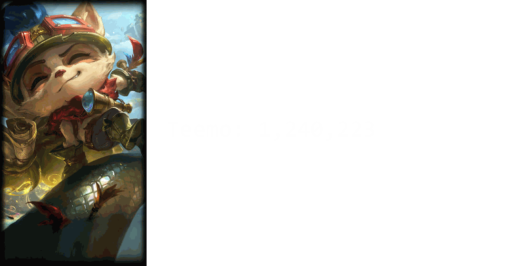

<picture>
  <source media="(prefers-color-scheme: dark)" srcset="assets/header-dark.svg"/>
  <source media="(prefers-color-scheme: light)" srcset="assets/header-light.svg"/>
  
</picture>

<p>
  <a href="https://www.linkedin.com/in/muratince89"></a>
  <a href="https://ms-solutions.dev/?utm_source=github&utm_medium=profile"></a>
</p>

<picture>
  <source media="(prefers-color-scheme: dark)" srcset="https://raw.githubusercontent.com/murriiii/murriiii/output/github-snake-dark.svg"/>
  <source media="(prefers-color-scheme: light)" srcset="https://raw.githubusercontent.com/murriiii/murriiii/output/github-snake.svg"/>
  
</picture>

---

```js
const murat = {
    day:       "SAP developer · ABAP, RAP, Fiori, CPQ",
    night:     ["iOS & Flutter apps", "applied AI", "homelab"],
    education: "B.Sc. Business Mathematics",
    studying:  "M.Sc. Applied AI (part-time)",
    code:      ["ABAP", "TypeScript", "Swift", "Dart", "Python", "SQL"],
    building:  ["akari", "salihiit", "jgl-diff"],
    motto:     "Late-game scaling — in code and in life.",
};
```

#### `> stack`

```text
languages    abap · typescript · swift · dart · python · sql
sap          sapui5 · fiori elements · s/4hana · cds · rap · cpq
apps & web   flutter · swift · xcode · android studio · next.js · react · hono
ml & data    pytorch · numpy · pandas · scikit-learn
infra        docker · linux · postgres · redis · cloudflare
```

---

<details>
<summary><b><code>> after hours</code></b> · league of legends</summary>

<!---LOL-STATS-START-HERE--->
<h3 align='center'>i know i'm a noob, but even a noob has pride :D - ムラット#2349</h3><table align='center'><tr></tr>
<tr align='left'><th><pre>Lane Distribution (Last 100 Games)
-------------------------


-------------------------
</pre></th><th><pre>Top 3 Champion Masteries
------------------------
 </pre></th></tr></table>

<details>
<summary><h4 align='center'>Recent Matches</h4></summary>
<table align='center'>
<tr><th></th><th>Champion</th><th>K/D/A</th><th>KDA</th><th>CS</th><th>Result</th></tr>
<tr><td></td><td><b>Urgot</b></td><td align='center'>8/13/10</td><td align='center'>1.4</td><td align='center'>332</td><td align='center'></td></tr>
<tr><td></td><td><b>Yorick</b></td><td align='center'>3/12/6</td><td align='center'>0.8</td><td align='center'>236</td><td align='center'></td></tr>
<tr><td></td><td><b>Urgot</b></td><td align='center'>6/2/1</td><td align='center'>3.5</td><td align='center'>135</td><td align='center'></td></tr>
<tr><td></td><td><b>Malzahar</b></td><td align='center'>9/8/10</td><td align='center'>2.4</td><td align='center'>205</td><td align='center'></td></tr>
<tr><td></td><td><b>Quinn</b></td><td align='center'>13/12/13</td><td align='center'>2.2</td><td align='center'>220</td><td align='center'></td></tr>
<tr><td></td><td><b>Malphite</b></td><td align='center'>8/2/9</td><td align='center'>8.5</td><td align='center'>155</td><td align='center'></td></tr>
<tr><td></td><td><b>Yorick</b></td><td align='center'>8/8/1</td><td align='center'>1.1</td><td align='center'>207</td><td align='center'></td></tr>
<tr><td></td><td><b>TahmKench</b></td><td align='center'>3/8/14</td><td align='center'>2.1</td><td align='center'>0</td><td align='center'></td></tr>
<tr><td></td><td><b>Urgot</b></td><td align='center'>6/9/6</td><td align='center'>1.3</td><td align='center'>2</td><td align='center'></td></tr>
<tr><td></td><td><b>Urgot</b></td><td align='center'>12/8/12</td><td align='center'>3.0</td><td align='center'>314</td><td align='center'></td></tr>
</table>
</details>
<!---LOL-STATS-END-HERE--->

</details>


