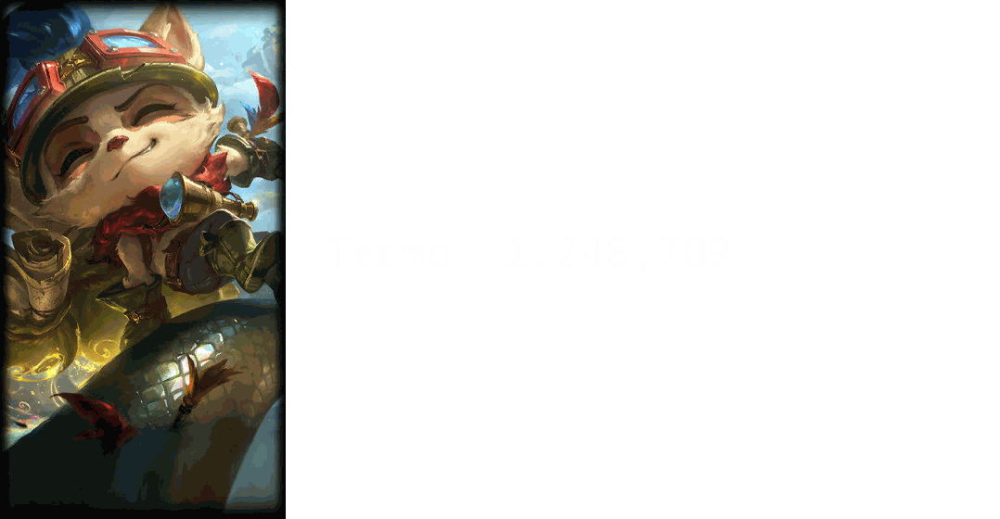

<picture>
  <source media="(prefers-color-scheme: dark)" srcset="assets/header-dark.svg"/>
  <source media="(prefers-color-scheme: light)" srcset="assets/header-light.svg"/>
  
</picture>

<p>
  <a href="https://www.linkedin.com/in/muratince89"></a>
  <a href="https://ms-solutions.dev/?utm_source=github&utm_medium=profile&utm_content=murat"></a>
</p>

<picture>
  <source media="(prefers-color-scheme: dark)" srcset="https://raw.githubusercontent.com/murriiii/murriiii/output/github-snake-dark.svg"/>
  <source media="(prefers-color-scheme: light)" srcset="https://raw.githubusercontent.com/murriiii/murriiii/output/github-snake.svg"/>
  
</picture>

---

```js
const murat = {
    day:       "SAP developer · ABAP, RAP, Fiori, CPQ",
    night:     ["iOS & Flutter apps", "applied AI", "homelab"],
    education: "B.Sc. Business Mathematics",
    studying:  "M.Sc. Applied AI (part-time)",
    code:      ["ABAP", "TypeScript", "Swift", "Dart", "Python", "SQL"],
    building:  ["akari", "salihiit", "jgl-diff"],
    motto:     "Late-game scaling — in code and in life.",
};
```

#### `> stack`

```text
languages    abap · typescript · swift · dart · python · sql
sap          sapui5 · fiori elements · s/4hana · cds · rap · cpq
apps & web   flutter · swift · xcode · android studio · next.js · react · hono
ml & data    pytorch · numpy · pandas · scikit-learn
infra        docker · linux · postgres · redis · cloudflare
```

---

<details open>
<summary><b><code>> after hours</code></b> · league of legends</summary>

<!---LOL-STATS-START-HERE--->
<h3 align='center'>i know i'm a noob, but even a noob has pride :D - ムラット#2349</h3><table align='center'><tr></tr>
<tr align='left'><th><pre>Lane Distribution (Last 100 Games)
-------------------------


-------------------------
</pre></th><th><pre>Top 3 Champion Masteries
------------------------
 </pre></th></tr></table>

<details open>
<summary><h4 align='center'>Recent Matches</h4></summary>
<table align='center'>
<tr><th></th><th>Champion</th><th>K/D/A</th><th>KDA</th><th>CS</th><th>Result</th></tr>
<tr><td></td><td><b>Illaoi</b></td><td align='center'>7/10/6</td><td align='center'>1.3</td><td align='center'>192</td><td align='center'></td></tr>
<tr><td></td><td><b>Urgot</b></td><td align='center'>6/12/9</td><td align='center'>1.2</td><td align='center'>335</td><td align='center'></td></tr>
<tr><td></td><td><b>MissFortune</b></td><td align='center'>17/8/15</td><td align='center'>4.0</td><td align='center'>207</td><td align='center'></td></tr>
<tr><td></td><td><b>Vayne</b></td><td align='center'>6/8/9</td><td align='center'>1.9</td><td align='center'>143</td><td align='center'></td></tr>
<tr><td></td><td><b>Naafiri</b></td><td align='center'>15/8/3</td><td align='center'>2.2</td><td align='center'>241</td><td align='center'></td></tr>
<tr><td></td><td><b>Urgot</b></td><td align='center'>9/8/4</td><td align='center'>1.6</td><td align='center'>204</td><td align='center'></td></tr>
<tr><td></td><td><b>Urgot</b></td><td align='center'>7/10/2</td><td align='center'>0.9</td><td align='center'>196</td><td align='center'></td></tr>
<tr><td></td><td><b>Teemo</b></td><td align='center'>2/4/2</td><td align='center'>1.0</td><td align='center'>160</td><td align='center'></td></tr>
<tr><td></td><td><b>Urgot</b></td><td align='center'>12/12/3</td><td align='center'>1.2</td><td align='center'>217</td><td align='center'></td></tr>
<tr><td></td><td><b>Urgot</b></td><td align='center'>4/11/10</td><td align='center'>1.3</td><td align='center'>234</td><td align='center'></td></tr>
</table>
</details>
<!---LOL-STATS-END-HERE--->

</details>


